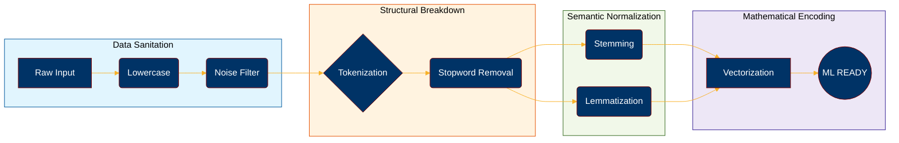

# 🌌 Text Preprocessing Architecture: NLP Masterclass

> "Garbage in, Garbage out." – The foundation of any high-performing NLP model lies in the meticulous preparation of its input data. This repository serves as a technical blueprint for state-of-the-art text preprocessing.

---

## 🏗️ The Preprocessing Blueprint

Preparing text isn't a single step; it's a multi-layered architectural process. This notebook implements a complete **End-to-End Pipeline**.

---

## 💎 Core Engineering Techniques

The [Technical Notebook](file:///d:/Office%20AssignMent/Text%20Preprocessing%20in%20Natural%20Language%20Processing%20%28NLP%29/Text_Preprocessing_in_Natural_Language_Processing_%28NLP.ipynb) deep-dives into 12 essential transformations:

### 🛡️ Phase 1: Cleansing & Standardization
*   **Lowercasing**: Harmonizing text for case-insensitive processing.
*   **Noise Removal**: Systematic deletion of Punctuation, Numbers, and Special Characters.
*   **Whitespace Optimization**: Ensuring structural integrity through space normalization.

### 🧩 Phase 2: Granular Decomposition
*   **Intelligent Tokenization**: Breaking down fluid text into atomic semantic units.
*   **Stopword Elimination**: Filtering high-frequency, low-entropy words to sharpen focus.

### 🧬 Phase 3: Linguistic Normalization
*   **Stemming (Porter)**: Aggressive heuristic-based root stripping.
*   **Lemmatization (WordNet)**: Context-aware morphological analysis for dictionary-level precision.

### 🔢 Phase 4: Foundational Vectorization
*   **N-gram Modeling**: Capturing local semantic context through sequential grouping.
*   **Bag of Words (BoW)**: Frequency-based numerical representation.
*   **TF-IDF Scoring**: Statistical weighting to emphasize distinctive features across the corpus.

---

## 🔍 Intellectual Deep-Dives

We don't just provide code; we provide insight. The notebook includes rigorous analysis on:
- ⚠️ **The NER Paradox**: How lowercasing can cripple Named Entity Recognition.
- ⚖️ **Stemming vs. Lemmatization**: Speed vs. Linguistic Accuracy.
- 📉 **The Dimensionality Challenge**: Managing the sparse matrices of BoW and TF-IDF.

---

## 🛠️ Stack & Integration

| Component | Technology |
| :--- | :--- |
| **Language** | Python 3.x |
| **NLP Engine** | NLTK (Natural Language Toolkit) |
| **Feature Extraction** | Scikit-Learn |
| **Regex** | Python `re` Module |

---

  <i>Developed with precision for Advanced Natural Language Processing Applications.</i>

