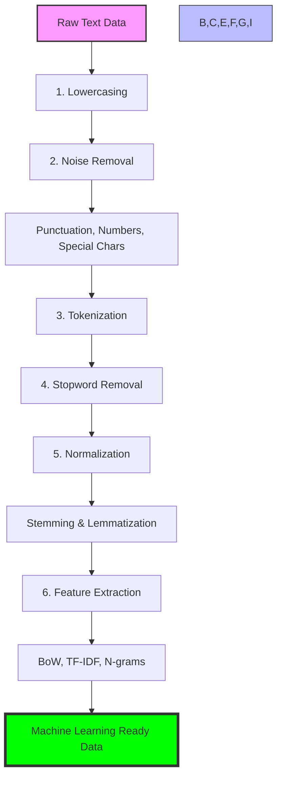

# Text Preprocessing in Natural Language Processing (NLP)

This repository contains a comprehensive Jupyter Notebook that explores and implements various text preprocessing and vectorization techniques essential for Natural Language Processing (NLP).

## 🚀 NLP Pipeline Overview

Below is a visual representation of the typical text preprocessing pipeline implemented in this project:

## 🚀 Overview

The project provides a step-by-step guide to cleaning and preparing text data for machine learning models. It covers everything from basic cleaning steps like lowercasing to advanced feature extraction techniques like TF-IDF.

## 🛠️ Techniques Covered

The provided notebook [Text Preprocessing in NLP](file:///d:/Office%20AssignMent/Text%20Preprocessing%20in%20Natural%20Language%20Processing%20%28NLP%29/Text_Preprocessing_in_Natural_Language_Processing_%28NLP.ipynb) demonstrates the following 12 techniques:

1.  **Lowercasing**: Converting text to a uniform case to reduce vocabulary size.
2.  **Removing Punctuation**: Cleaning special characters that don't add semantic value.
3.  **Tokenization**: Splitting text into individual words or tokens.
4.  **Stopword Removal**: Filtering out common words (e.g., "is", "the") that carry little information.
5.  **Stemming**: Reducing words to their root form (e.g., "playing" → "play").
6.  **Lemmatization**: Converting words to their dictionary base form (e.g., "better" → "good").
7.  **Removing Numbers**: Deleting digits to simplify text data.
8.  **Removing Special Characters**: Cleaning emojis, symbols, and non-alphanumeric characters.
9.  **Removing Extra Whitespaces**: Ensuring uniform spacing and cleaning up formatting errors.
10. **N-grams**: Grouping adjacent words (Unigrams, Bigrams, Trigrams) to capture context.
11. **Bag of Words (BoW)**: Representing text based on word frequency.
12. **TF-IDF**: weighting words based on their importance and rarity across documents.

## 🧠 Critical Thinking Points

The notebook also dives into the "Why" behind these techniques, discussing:
- When lowercasing might harm **Named Entity Recognition (NER)**.
- Why removing **numbers and names** can lead to information loss in specific tasks (like schedules or chatbots).
- The trade-offs between **Stemming vs. Lemmatization**.
- The limitations of **Bag of Words** compared to **TF-IDF**.

## 📦 Dependencies

The implementation uses the following Python libraries:
- `nltk`: For Natural Language Toolkit (Stemming, Lemmatization, N-grams).
- `scikit-learn`: For feature extraction (CountVectorizer, TfidfVectorizer).
- `re`: For regular expression-based cleaning.
- `string`: For punctuation handling.

---
*Created as part of an Office Assignment on NLP Text Preprocessing.*

